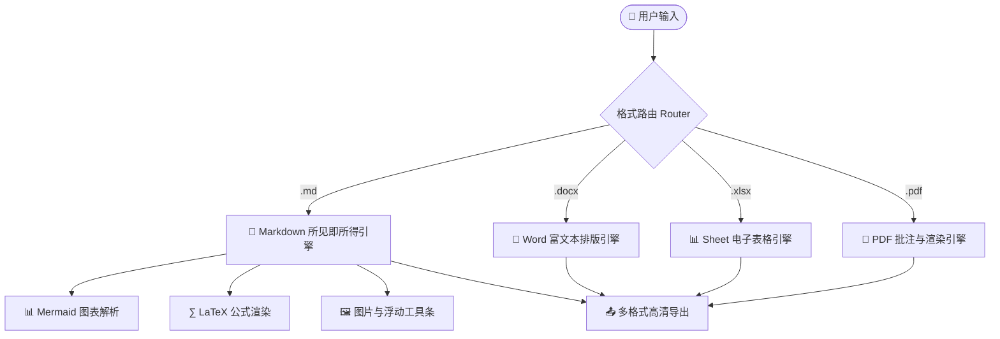
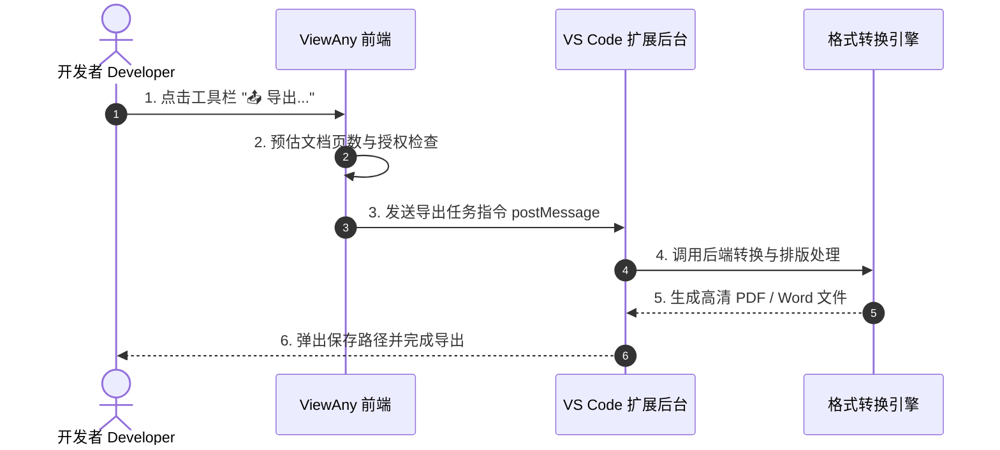
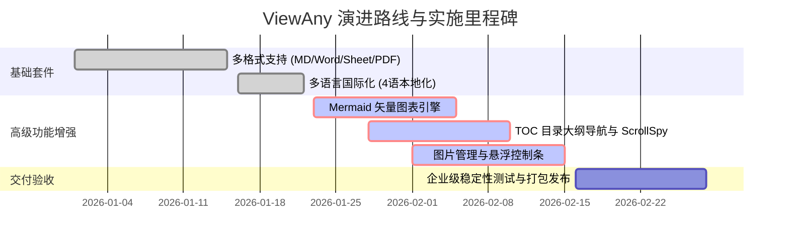

# ViewAny Markdown 全功能综合体验与演示文档

欢迎使用 **ViewAny Markdown** 所见即所得富文本套件！本文档汇集了 **目录大纲导航**、**Mermaid 矢量图表**、**图片多维管理**、**LaTeX 高清数学公式** 以及 **全功能导出** 等高级功能演示。

## 1\. 目录导航与大纲层级 (TOC & Outline)

左侧已集成**目录大纲侧边栏**（点击上方工具条中的 `📑 目录` 按钮可随时折叠/展开）。

### 1.1 大纲核心特性

*   **多级嵌套**：自动提取文档中的 H1-H6 标题，以优雅的缩进树形展示。
    
*   **平滑定位**：点击任意大纲条目，文档平滑滚动定位并伴随章节高亮动效。
    
*   **实时联动 (ScrollSpy)**：当在文档中滚动时，左侧目录会自动跟随高亮当前阅读位置。
    
*   **即时搜索**：在大纲上方的搜索框输入关键词，即时过滤匹配的章节。
    

## 2\. Mermaid 流程图与图表渲染与编辑

ViewAny 内置 **Mermaid 渲染与交互式编辑器**。在所见即所得模式下，图表将直接呈现为高质量矢量 SVG，点击或悬停点击右上角 `✎ 编辑图表` 即可修改源码并实时预览。

### 2.1 架构流程图 (Flowchart)

### 2.2 交互时序图 (Sequence Diagram)

### 2.3 甘特图计划 (Gantt Chart)

## 3\. 图片插入、拖拽上传与浮动工具栏

ViewAny 提供多维度的图片管理功能：

1. 插入途径：点击工具栏中的 🖼️ 图片 按钮，通过网络 URL 或本地文件选择器插入。直接从系统剪贴板复制截图并在文档中 Ctrl+V 粘贴（自动转为 Data URL）。从文件管理器直接拖拽图片文件到文档中。
2. 交互式浮动控制栏：在所见即所得视图中点击下方示例图片，将自动浮现图片控制栏。支持快速缩放：25%、50%、75%、100%。支持对齐方式：⇤ 靠左浮动、≡ 居中对齐、⇥ 靠右浮动。支持直接编辑 Alt 描述说明、替换图片与一键删除。

## 4\. LaTeX 高清数学与数字公式

ViewAny 支持块级与行内数学公式渲染：

行内公式示例：质能守恒方程 $E = mc^2$，欧拉恒等式 $e^{i\pi} + 1 = 0$。

块级多行公式示例：

$$
\int_{-\infty}^{+\infty} e^{-x^2} dx = \sqrt{\pi}, \quad \sum_{n=1}^{\infty} \frac{1}{n^2} = \frac{\pi^2}{6}
$$

高斯正态分布密度函数：

$$
f(x) = \frac{1}{\sigma \sqrt{2\pi}} \exp\left( -\frac{(x - \mu)^2}{2\sigma^2} \right)
$$

## 5\. 数据表格与富文本元素

| 功能模块 | 支持特性 | 适用格式 | 状态 |
| --- | --- | --- | --- |
| **目录大纲导航** | 树形折叠、平滑定位、ScrollSpy、搜索过滤 | Markdown | ✅ 已就绪 |
| **Mermaid 图表** | 流程图、时序图、甘特图、类图、脑图等 | Markdown | ✅ 已就绪 |
| **图片管理** | 剪贴板粘贴、拖拽上传、尺寸缩放、对齐工具栏 | Markdown | ✅ 已就绪 |
| **多格式导出** | PDF / DOCX / HTML / 表格无限制导出 | 全格式 | 👑 VIP尊享 |

> 提示：在上方模式切换栏中点击 `双栏分屏` 或 `纯源码`，可以实时比对富文本渲染与逆向生成的 Markdown 代码。